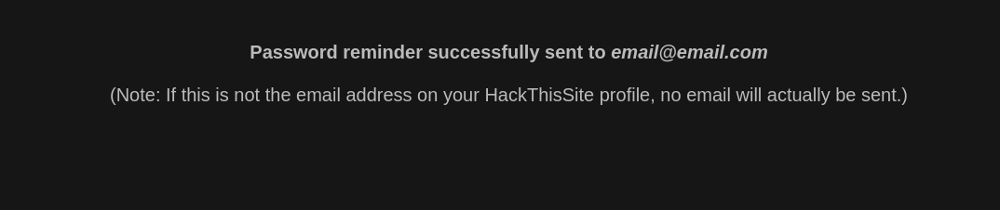

# Basic Missions

### Mission 1

Challenge link [here](https://www.hackthissite.org/missions/basic/1/)

Very simple. Just read the source code and get the password.


Password = **6d82f9c6**

----

### Mission 2

Challenge link [here](https://www.hackthissite.org/missions/basic/2/)

Since password file is not uploaded just click submit with blank text to complete this mission.

----

### Mission 3 

Challenge link [here](https://www.hackthissite.org/missions/basic/3/)


Looking at the source code near form field, there is a hidden file input with value *password.php*. Opening password.php from browser gives away the password.


Password = **984df9c0**

----

### Mission 4

Challenge link [here](https://www.hackthissite.org/missions/basic/4/)


In the hidden input, email form field just change the value of the default email to your email. Then the remainder of the password has been sent to your email. 


Password = **252903de**

----

### Mission 5

Challenge link [here](https://www.hackthissite.org/missions/basic/5/)

Same as above.

Password = **fae5169e**

----

### Mission 6

Challenge link [here](https://www.hackthissite.org/missions/basic/6/)

This one requires some simple cryptography knowledge! But have no fear, it is simpler than you might at first think if you are new to this.


We are given multiple points of information:

The ability to encrypt a plain-text string into encrypted form
The encryped version of Sam's password: e72hj><8 (previously obtained through an unspecified method)
Therefore in order to solve this challenge, we need to decrypt Sam's password back into its original version. We can do that by working out how the encryption process works.

Since we do not have access to the encryption code, we'll have to look for patterns in known pairs of encrypted and unencryped values. We can do that by entering random strings into the first box, and recording what the resulting encryped value is for each.

A few things to try:

Repeated characters: aaaaa
Repeated patterns: abcabc
Counting: 12345
Alphabet: abcdef
You might notice something interesting through doing this.

For example, aaaaa becomes abcde - this tells us that the same character is encryped differently based on position in the string, so it's not a simple cypher where one thing always matches something else. It also shows us that the difference is sequential!

If you next try 12345 you will get 13579. This isn't sequential, but gives us more data to work with.

So how do you handle the special characters like > and <? Consider where you can find a list of these characters together - letters, numbers, and symbols. They are all Unicode characters, and each Unicode character has a numerical designation!

Now, use what we've learned to solve the challenge. Take note that the first character does not change. The encryped version is identical to what you passed in. Every other character changes based on the position in the string.

Our encryped password is: e72hj><8

Let's separate that into string positions, starting at zero because the first one doesn't change. We can also determine the unicode decimal value for each character.


Try modifying the unicode value based on the position of the character in the string, and you'll get your answer 

### Mission 7

Challenge link [here](https://www.hackthissite.org/missions/basic/7/)

As said by the question there our input returns the output from the UNIX cal command. We know that the password for this level is saved in some file in the same directory. Therefore we need to input **; ls** as payload. The **semicolon(;)** terminates the previous command **cal** and **ls** is used to list files in the directory.


We saw a stranger file *k1kh31b1n55h.php*. Read the content of the file from your browser to get the password. 

Password = **d723d108**

----

### Mission 8

Challenge link [here](https://www.hackthissite.org/missions/basic/8/)

After learning about SSI from [Wikipedia](https://en.wikipedia.org/wiki/Server_Side_Includes) and [OWASP](https://www.owasp.org/index.php/Main_Page). Then clearly our payload will be

```

<!--#exec cmd="ls .." -->

```


We saw a stranger file *au12ha39vc.php*. Read the content of the file from your browser to get the password.

Password = **83e0172c**

----
